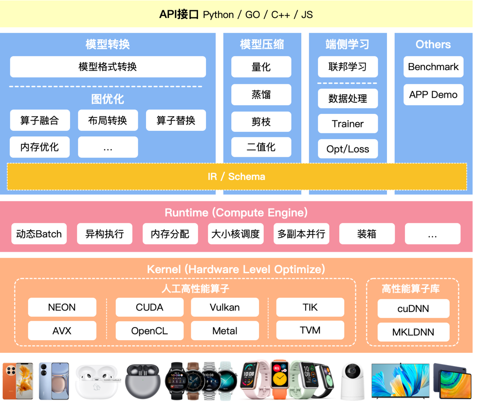

# Overview

## 设计思想

* 提供基础的算法底层库和基础功能，支持上层的依赖
* 提供内存池管理，线程池调度等基础组件
* 提供基础的数据结构，如image/tensor等
* 提供基础的日志输出库

## 目的

* Keep Simple

## 环境配置

* Ubuntu 16.04
* gcc > 5.0+
* [开发环境配置]()
* [git-lfs配置]()
* [git message](https://github.com/streamich/git-cz)

## 编译

## Linux-x86_64 Sample使用

* sh scripts/build_linux_x86.sh

## [代码规范]
* [格式化代码](.clang-format)
* 分支管理
  * 在新建分支开发时，尽量基于最新的开发分支进行，减少后续的合并冲突
  * 命名规范:<type>/+动宾描述 (example: fix/fix_detector_memory_leak)
* git message规范，请按照：`<type>(<scope>): <subject>` 格式编写提交信息，其中每个字段含义为：
* `<type>`：提交的类型，必填！只能为以下七种类型中的一种：
  * feat：新功能（面向用户的新功能特性，或有重大提升的功能）
  * fix：问题修复（侧重于功能的修复，而非编译、构建或部署时的错误）
  * test：测试相关
  * refactor：重构代码（除新功能和问题修复以外的代码变动）
  * docs：文档相关
  * style：代码风格相关
  * chore：其他（以上六种均不符合时，归到本类型中，比如构建、部署相关）
* `<subject>`：提交的主题信息，**必填**.
* `<scope>`：提交涉及的范围，可选（不填时要连同括号一起省略）